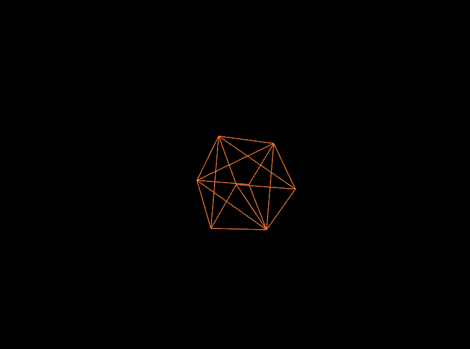

# OpenGL Game
## About
 \
This program is written in C++ and uses the OpenGL API to render a cube and has basic movement and mouse functionality to control the camera.
Rather than a game itself, the program is more of a basic skeleton or boilerplate code to begin creating an actual game.
The main purpose of creating the program was to learn about the OpenGL API and come up with a way to structure the API calls with functionality grouped by containerized classes.
## Structure 
**Folders**
- dependencies - contains lib files needed to be linked during compilation
- headers - contains header files for OpenGL and other external libraries
- output - contains all .obj files and executable after compilation
- resources - contains game resources such as shaders and textures \
**Files**
- assets.h - manages the loading of all vertices, buffer objects, and textures
- camera.h - calculates all of the vectors and matrices for mapping the world onto a 2D plane, stores the view and projection matrices
- ebo.h - manages element buffer object GL calls
- gl.h - stores global include statements and global variables
- main.cpp - starts the program
- renderer.h - call and assemble all other components of the game to render the game state, user input passed to update the game state
- shader.h - loads shaders and stores the GL shader program pointer
- vao.h - manages vertex attribute object GL calls
- vbo.h - manages vertex buffer object GL calls
- window.h - creates the window for the program to render to, contains the main render loop
## Libraries
For loading an OpenGL context, the **GLAD** library was used since it seems the most widely used and well documented. **GLEW** is another alternative but I found less documentation and had some trouble setting it up. For window creation, **GLFW** was used since it is the most popular choice and its interface seemed simpler compared to **GLUT**. For vertex and matrix calculations, **GLM** was used because it was purpose built for OpenGL compatibility.
