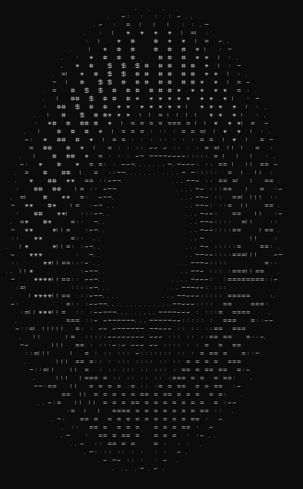

# Spinning Donut
## About
This program was written based on a video of Lex Fridman. Full writeup [here](https://github.com/loltyler1dotcom-discount-code-alpha/Projects/blob/master/Spinning%20Donut/Writeup/Writeup.pdf).
The program calculates a torus of large radius 2 and small radius 1 with a parameterization, calculates a normal vector for each point on the surface, applies a transformation matrix on the points every frame of the animation, and then uses the normal vectors to calculate a brightness for the pixel. The program renders the donut using ascii characters. The character set used to render the donut was identical to the one shown in the video so that comparison of the results would be easier. The code was relatively short but the number of lines of code in this program is not representative of the amount of time it took. 
## Structure
- **Matrix4f.cpp** - class to encapsulate the matrix transformation to rotate and translate the torus, the public interface is limited to getting matrix elements, setting coordinates to translate the torus, and applying the matrix transformation to given coordinates
- **Shape.cpp** - class that parameterizes the torus, applies the matrix transformation, sends the coordinates and brightness values of each point to the Renderer
- **Renderer.cpp** - class that maps brightness values from the Shape class to a set of ASCII characters and displays them on the screen, should also clear the screen each render cycle but ANSI escape codes aren't supported on Windows so that feature is untested
- **main.cpp** - initializes the Shape and Renderer classes and controls the timing of render calls
- **global.h** - contains all of the global constants such as the rotation angle deltas, FPS, torus translation coordinates, etc.
## Example
Frame of ASCII animation: \

